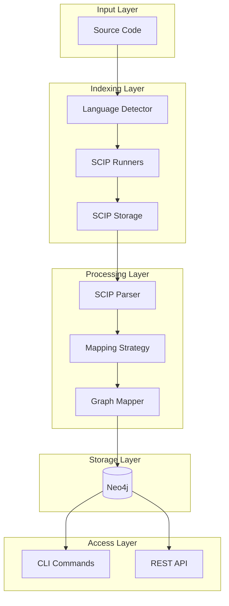
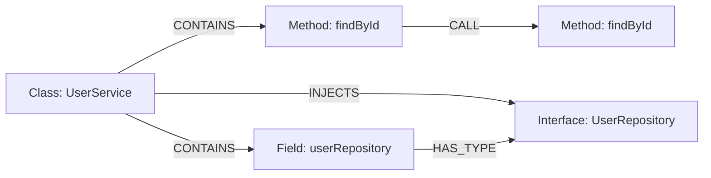
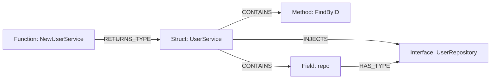

# Kiến Trúc và Workflow của Codebase Graph

Tài liệu này mô tả chi tiết cách thức hoạt động, kiến trúc hệ thống và quy trình xử lý dữ liệu của project **Codebase Graph**.

## 1. Tổng Quan

**Codebase Graph** không chỉ đơn thuần là một công cụ chạy SCIP (Source Code Indexing Protocol). Nó đóng vai trò là một **Semantic Layer** (Lớp ngữ nghĩa) chuyển đổi dữ liệu thô từ SCIP thành một **Knowledge Graph** (Đồ thị tri thức) có khả năng truy vấn phức tạp.

### Tại sao không chỉ dùng SCIP?
- **SCIP** là một định dạng trung gian (intermediate format) tốt để lưu trữ cấu trúc code, nhưng nó là dữ liệu tĩnh (static data).
- **Codebase Graph** biến dữ liệu tĩnh đó thành dữ liệu động trong Database, cho phép trả lời các câu hỏi như: *"Hàm A gọi hàm nào?", "Ai đang sử dụng Class B?", "Service này phụ thuộc vào những thư viện nào?"*.

### Ngôn Ngữ Hỗ Trợ
- **Java** (Maven, Gradle projects)
- **Go** (Go modules)
- **Python** (pip, poetry projects)
- **TypeScript** (npm projects) - planned

---

## 2. Kiến Trúc Hệ Thống

Hệ thống bao gồm 5 thành phần chính hoạt động phối hợp với nhau:



### Chi Tiết Các Thành Phần:

1. **Language Detector:** Tự động nhận diện ngôn ngữ dựa trên build files (pom.xml, go.mod, requirements.txt).

2. **SCIP Runners (Template Method Pattern):**
   - `AbstractScipRunner` - Base class với template method
   - `ScipJavaRunner` - Xử lý Maven/Gradle projects
   - `ScipGoRunner` - Xử lý Go modules  
   - `ScipPythonRunner` - Xử lý Python projects

3. **SCIP Storage:** Quản lý lưu trữ và versioning các file index.scip với metadata.

4. **Mapping Strategy (Strategy Pattern):**
   - `JavaStrategy` - Xử lý constructor/field injection patterns
   - `GoStrategy` - Xử lý struct/interface patterns
   - `PythonStrategy` - Xử lý __init__ injection, Depends() patterns

5. **Graph Store:** Lưu trữ vào Neo4j với đầy đủ relationships.

---

## 3. Design Patterns

### 3.1 Template Method Pattern - SCIP Runners

```
AbstractScipRunner
├── runIndex() [template method - final]
│   ├── validateEnvironment()
│   ├── preProcess() [hook]
│   ├── executeIndexer()
│   └── postProcess() [hook]
├── getToolCommand() [abstract]
├── getIndexArgs() [abstract]
└── isValidProject() [abstract]

ScipJavaRunner extends AbstractScipRunner
├── getToolCommand() → "scip-java"
├── preProcess() → fix CRLF in mvnw
└── isValidProject() → check pom.xml/build.gradle
```

### 3.2 Strategy Pattern - Language Mapping

```
LanguageMappingStrategy [interface]
├── extractContainsRelationships()
├── extractTypeRelationships()
├── extractDependencyInjection()
└── parseParentSymbolId()

JavaStrategy implements LanguageMappingStrategy
├── Detects: @Autowired, constructor injection
└── Parses: scip-java symbol format

GoStrategy implements LanguageMappingStrategy
├── Detects: NewXxx() constructors, struct fields
└── Parses: scip-go symbol format

PythonStrategy implements LanguageMappingStrategy
├── Detects: __init__ params, Depends()
└── Parses: scip-python symbol format
```

---

## 4. SCIP Index Storage

Mỗi lần index được lưu với định danh duy nhất:

```
scip-indices/
├── {project-name}-20260201143052.scip
├── {project-name}-20260201143052.json  (metadata)
├── {project-name}-20260131120000.scip
└── {project-name}-20260131120000.json
```

### Index Metadata
```json
{
  "id": "myproject-20260201143052",
  "projectName": "myproject",
  "language": "JAVA",
  "indexedAt": "2026-02-01T14:30:52Z",
  "status": "STORED",
  "documentCount": 45,
  "symbolCount": 1234,
  "occurrenceCount": 5678
}
```

### Index Status Flow
```
CREATED → PARSED → MAPPED → STORED
                         ↘ FAILED
```

---

## 5. Data Model (Mô Hình Dữ Liệu)

### Nodes (Thực thể)
| Node Label | Mô tả | Thuộc tính chính |
| :--- | :--- | :--- |
| `Repository` | Dự án phần mềm | `name`, `path`, `language` |
| `SourceFile` | File mã nguồn | `path`, `name` |
| `Symbol` | Đơn vị code | `name`, `kind`, `signature`, `visibility`, `isStatic` |

### Symbol Kinds
| Kind | Mô tả |
| :--- | :--- |
| `CLASS`, `INTERFACE`, `ENUM` | Types |
| `STRUCT`, `TRAIT` | Go/Rust types |
| `METHOD`, `STATIC_METHOD`, `ABSTRACT_METHOD` | Callables |
| `CONSTRUCTOR`, `FUNCTION`, `LAMBDA` | Callables |
| `FIELD`, `STATIC_FIELD`, `CONSTANT` | Members |
| `PARAMETER`, `VARIABLE` | Variables |

### Relationships (Quan hệ)

#### Structural
| Quan hệ | Ý nghĩa |
| :--- | :--- |
| `CONTAINS` | Parent chứa child (Package→Class, Class→Method) |
| `BELONGS_TO` | File thuộc Repository |

#### Type Relationships
| Quan hệ | Ý nghĩa |
| :--- | :--- |
| `HAS_TYPE` | Field/Parameter có kiểu X |
| `RETURNS_TYPE` | Method trả về kiểu X |
| `EXTENDS` | Class kế thừa Class |
| `IMPLEMENTS` | Class implement Interface |

#### Usage Relationships
| Quan hệ | Ý nghĩa |
| :--- | :--- |
| `CALL` | Method gọi method khác |
| `FIELD_ACCESS` | Truy cập field |
| `TYPE_REF` | Sử dụng type |
| `IMPORT` | Import package/module |
| `CREATES` | Tạo instance (new X()) |

#### Dependency Injection
| Quan hệ | Ý nghĩa |
| :--- | :--- |
| `INJECTS` | Class được inject service (DI) |
| `ANNOTATED_WITH` | Symbol có annotation X |

---

## 6. CLI Commands

### Index Project
```bash
# Basic indexing
codebase-graph index /path/to/project

# With options
codebase-graph index /path/to/project \
  --language java \
  --storage ./my-indices \
  --skip-scip  # Use existing index.scip
```

### List Indices
```bash
# List all indices for a project
codebase-graph list-indices myproject

# List recent indices
codebase-graph list-indices --limit 10
```

### Query
```bash
# Find symbol
codebase-graph query --name UserService

# Find dependencies
codebase-graph query --depends-on UserRepository
```

### Serve API
```bash
codebase-graph serve --port 8080
```

---

## 7. Workflow Chi Tiết

### Bước 1: Detect Language
```
Input: /path/to/project
├── pom.xml found? → JAVA
├── go.mod found? → GO
├── requirements.txt found? → PYTHON
└── package.json found? → TYPESCRIPT
```

### Bước 2: Run SCIP Indexer
```
AbstractScipRunner.runIndex()
├── preProcess() - Language-specific prep (e.g., fix mvnw CRLF)
├── Execute: scip-java index --output index.scip
└── postProcess() - Cleanup
```

### Bước 3: Store Index
```
ScipIndexStorage
├── Generate unique path: myproject-20260201143052.scip
├── Create metadata with CREATED status
└── Save to storage folder
```

### Bước 4: Parse SCIP
```
ScipParser.parse(indexPath)
├── Read protobuf binary
├── Extract Documents, Symbols, Occurrences
└── Update metadata: status = PARSED
```

### Bước 5: Map to Graph (Strategy Pattern)
```
ScipToGraphMapper.map(index, language)
├── Create base symbols and references
├── strategy.extractContainsRelationships()
├── strategy.extractTypeRelationships()
├── strategy.extractDependencyInjection()
└── Update metadata: status = MAPPED
```

### Bước 6: Store in Neo4j
```
Neo4jGraphStore.store(mappingResult)
├── Create Repository node
├── Create SourceFile nodes
├── Create Symbol nodes
├── Create all Relationships
└── Update metadata: status = STORED
```

---

## 8. Ví Dụ: Java với Dependency Injection

```java
@Service
public class UserService {
    private final UserRepository userRepository;
    
    public UserService(UserRepository userRepository) {
        this.userRepository = userRepository;
    }
    
    public User findById(Long id) {
        return userRepository.findById(id);
    }
}
```

**Graph được tạo:**



---

## 9. Ví Dụ: Go với Struct

```go
type UserService struct {
    repo UserRepository
}

func NewUserService(repo UserRepository) *UserService {
    return &UserService{repo: repo}
}

func (s *UserService) FindByID(id int64) (*User, error) {
    return s.repo.FindByID(id)
}
```

**Graph được tạo:**



---

## 10. API Endpoints

| Method | Endpoint | Mô tả |
| :--- | :--- | :--- |
| GET | `/api/symbols` | List symbols with filters |
| GET | `/api/symbols/{id}` | Get symbol by ID |
| GET | `/api/symbols/{id}/references` | Get symbol references |
| GET | `/api/symbols/{id}/callers` | Get methods calling this |
| GET | `/api/files` | List source files |
| GET | `/api/files/{path}/symbols` | Get symbols in file |
| GET | `/api/graph/dependencies` | Get dependency graph |
| GET | `/health` | Health check |
