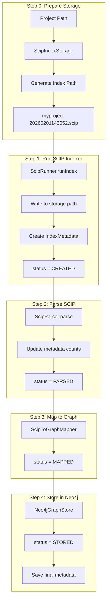
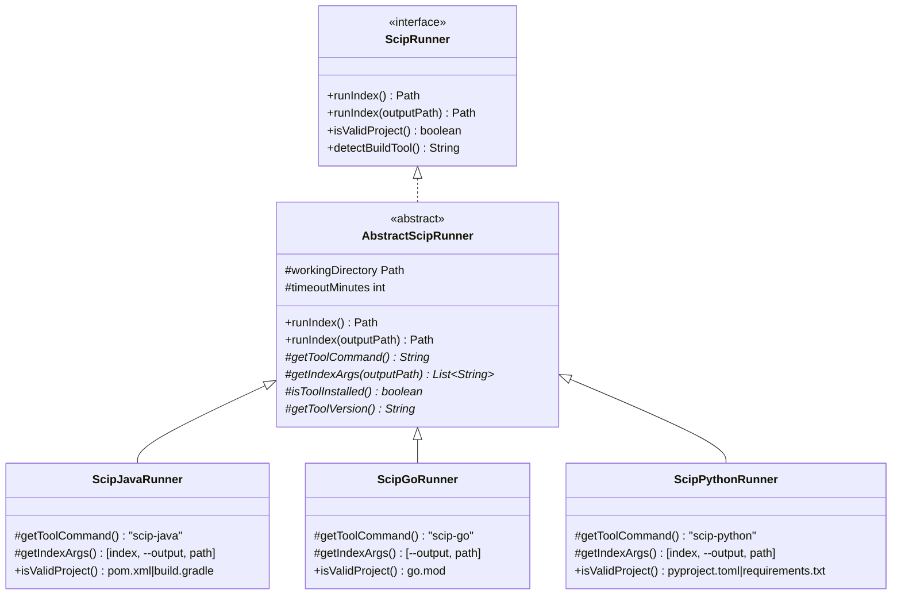
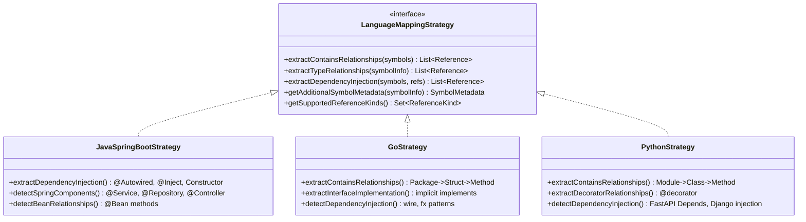
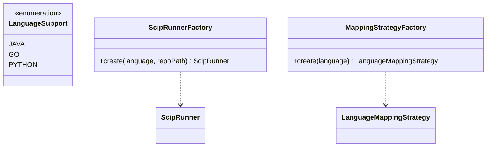

# Refactor Multi-Language Support with Design Patterns

## Overview

Refactor code structure using design patterns to support Java (Spring Boot), Go, and Python with language-specific relationship detection (DI, Contains, Type relationships).

## Goals

- Ho tro 3 ngon ngu: **Java/Spring Boot**, **Go**, **Python**
- Giam code duplication trong ScipRunner (hien ~90% trung lap)
- Tach logic language-specific ra khoi ScipToGraphMapper
- De dang mo rong them ngon ngu moi

## Status

| Task ID | Description | Status |
|---------|-------------|--------|
| **SCIP Storage** | | |
| create-scip-storage | Tao ScipIndexStorage class quan ly luu tru va dinh danh SCIP files | pending |
| create-index-metadata | Tao IndexMetadata record luu thong tin ve moi index file | pending |
| update-index-command | Cap nhat IndexCommand su dung ScipIndexStorage | pending |
| **Runner Refactoring** | | |
| create-language-enum | Tao LanguageSupport enum voi JAVA, GO, PYTHON | pending |
| create-abstract-runner | Tao AbstractScipRunner voi Template Method pattern | pending |
| refactor-java-runner | Refactor ScipJavaRunner extend AbstractScipRunner | pending |
| create-go-runner | Tao ScipGoRunner extend AbstractScipRunner | pending |
| refactor-python-runner | Refactor ScipPythonRunner extend AbstractScipRunner | pending |
| **Mapping Strategy** | | |
| create-mapping-strategy | Tao LanguageMappingStrategy interface | pending |
| create-java-strategy | Tao JavaSpringBootStrategy voi DI detection | pending |
| create-go-strategy | Tao GoStrategy voi struct/interface handling | pending |
| create-python-strategy | Tao PythonStrategy voi __init__ injection, Depends() | pending |
| create-strategy-factory | Tao MappingStrategyFactory | pending |
| update-sciptographmapper | Update ScipToGraphMapper su dung Strategy pattern | pending |
| **Model Updates** | | |
| update-reference-kind | Mo rong ReferenceKind enum | pending |
| update-symbol-kind | Mo rong SymbolKind enum | pending |
| update-symbol-model | Mo rong Symbol record voi metadata moi | pending |
| **Other** | | |
| update-language-detector | Update LanguageDetector ho tro Go | pending |
| update-runner-factory | Update ScipRunnerFactory ho tro Go | pending |
| write-tests | Viet unit tests va integration tests | pending |

---

## Phan 0: SCIP Index Storage & Versioning

### Van De

Hien tai, file `index.scip` duoc tao truc tiep trong folder project va bi ghi de moi lan index. Khong co cach:
- Theo doi lich su cac lan index
- So sanh giua cac version
- Re-process tu file cu

### Giai Phap

Tao he thong luu tru va dinh danh cho SCIP index files.

### Folder Structure

```
.codebase-graph/                    # Root storage folder (configurable)
├── indices/                        # SCIP index files
│   ├── myproject-20260201143052.scip
│   ├── myproject-20260201150030.scip
│   └── another-proj-20260201160000.scip
├── metadata/                       # Index metadata files
│   ├── myproject-20260201143052.json
│   └── another-proj-20260201160000.json
└── config.json                     # Storage configuration
```

### File Naming Convention

```
{project-name}-{yyyyMMddHHmmss}.scip
```

**Examples:**
- `elasticsearch-springboot-20260201143052.scip`
- `user-service-20260201150030.scip`

### IndexMetadata Record

```java
public record IndexMetadata(
    String id,                      // Unique ID = filename without extension
    String projectName,             // Project name
    String projectPath,             // Original project path
    String language,                // java, go, python
    Instant indexedAt,              // Timestamp
    Path scipFilePath,              // Path to .scip file
    long fileSize,                  // File size in bytes
    int documentCount,              // Number of documents in index
    int symbolCount,                // Total symbols
    int occurrenceCount,            // Total occurrences
    String indexerVersion,          // scip-java version, etc.
    IndexStatus status              // CREATED, PARSED, MAPPED, STORED
) {}

public enum IndexStatus {
    CREATED,    // SCIP file generated
    PARSED,     // Protobuf parsed successfully  
    MAPPED,     // Mapped to graph model
    STORED      // Saved to Neo4j
}
```

### ScipIndexStorage Class

```java
public class ScipIndexStorage {
    private final Path storageRoot;
    
    public ScipIndexStorage(Path storageRoot) {
        this.storageRoot = storageRoot;
    }
    
    /**
     * Generate a new index file path with timestamp.
     */
    public Path generateIndexPath(String projectName) {
        String timestamp = DateTimeFormatter.ofPattern("yyyyMMddHHmmss")
            .format(LocalDateTime.now());
        String filename = projectName + "-" + timestamp + ".scip";
        return storageRoot.resolve("indices").resolve(filename);
    }
    
    /**
     * Save metadata for an index.
     */
    public void saveMetadata(IndexMetadata metadata) { ... }
    
    /**
     * Load metadata by ID.
     */
    public IndexMetadata loadMetadata(String id) { ... }
    
    /**
     * List all indices for a project.
     */
    public List<IndexMetadata> listIndices(String projectName) { ... }
    
    /**
     * Get the latest index for a project.
     */
    public Optional<IndexMetadata> getLatestIndex(String projectName) { ... }
    
    /**
     * Delete old indices, keeping only the N most recent.
     */
    public void cleanupOldIndices(String projectName, int keepCount) { ... }
}
```

### Updated Workflow



### CLI Changes

```bash
# Index với storage mặc định (.codebase-graph/)
codebase-graph index /path/to/project

# Index với custom storage
codebase-graph index /path/to/project --storage /custom/storage

# List all indices for a project
codebase-graph list-indices myproject

# Re-process từ existing index file
codebase-graph reprocess myproject-20260201143052

# Cleanup old indices (keep 5 most recent)
codebase-graph cleanup myproject --keep 5
```

---

## Phan 1: Design Patterns Su Dung

### 1.1 Template Method Pattern - Cho ScipRunner

**Van de hien tai:** `ScipJavaRunner`, `ScipPythonRunner`, `ScipTypescriptRunner` co ~90% code giong nhau.

**Giai phap:** Tao `AbstractScipRunner` chua common logic, cac subclass chi override phan khac biet.



### 1.2 Strategy Pattern - Cho Language-Specific Graph Mapping

**Van de:** Logic phat hien DI (Spring Boot), module imports (Go), decorators (Python) khac nhau.

**Giai phap:** Tao `LanguageMappingStrategy` interface, moi ngon ngu co implementation rieng.



### 1.3 Factory Pattern - Enhanced



---

## Phan 2: Cau Truc Thu Muc Moi

```
src/main/java/org/example/
├── scip/
│   ├── runner/
│   │   ├── ScipRunner.java              # Interface
│   │   ├── AbstractScipRunner.java      # Template Method base class
│   │   ├── ScipJavaRunner.java          # Java implementation
│   │   ├── ScipGoRunner.java            # Go implementation (NEW)
│   │   └── ScipPythonRunner.java        # Python implementation
│   │
│   ├── mapper/
│   │   ├── ScipToGraphMapper.java       # Core mapper (language-agnostic)
│   │   ├── LanguageMappingStrategy.java # Strategy interface
│   │   ├── java/
│   │   │   └── JavaSpringBootStrategy.java
│   │   ├── go/
│   │   │   └── GoStrategy.java
│   │   └── python/
│   │       └── PythonStrategy.java
│   │
│   ├── factory/
│   │   ├── ScipRunnerFactory.java
│   │   └── MappingStrategyFactory.java
│   │
│   ├── ScipParser.java
│   ├── ScipException.java
│   └── LanguageDetector.java
│
├── model/
│   ├── Symbol.java                       # Extended with new fields
│   ├── SymbolKind.java                   # Extended with language-specific kinds
│   ├── Reference.java
│   ├── ReferenceKind.java                # Extended with new kinds
│   └── LanguageSupport.java              # NEW: Enum for supported languages
```

---

## Phan 3: Language-Specific Relationships

### 3.1 Java/Spring Boot

**Dependency Injection Patterns:**

```java
// Constructor Injection (recommended)
@Service
public class UserService {
    private final UserRepository repository;  // INJECTS -> UserRepository
    
    public UserService(UserRepository repository) {
        this.repository = repository;
    }
}

// Field Injection
@Controller
public class UserController {
    @Autowired
    private UserService userService;  // INJECTS -> UserService
}

// Setter Injection
@Component
public class OrderService {
    private PaymentService payment;
    
    @Autowired
    public void setPaymentService(PaymentService payment) {
        this.payment = payment;  // INJECTS -> PaymentService
    }
}
```

**Detection Strategy:**

1. Tim classes co annotation `@Service`, `@Repository`, `@Controller`, `@Component`
2. Tim fields co type la Spring component
3. Tim constructor parameters co type la Spring component
4. Tao INJECTS relationship

### 3.2 Go

**Structural Relationships:**

```go
// Package contains types
package service

// Struct contains fields and methods
type UserService struct {
    repo UserRepository  // HAS_TYPE -> UserRepository
}

// Interface implementation (implicit)
func (s *UserService) FindById(id int) User { ... }  // IMPLEMENTS -> UserRepository (if interface matches)
```

**DI Patterns (Wire/Fx):**

```go
// Wire pattern
func InitializeUserService(repo UserRepository) *UserService {
    return &UserService{repo: repo}  // INJECTS -> UserRepository
}

// Fx pattern
fx.Provide(NewUserService)
fx.Invoke(func(svc *UserService) { ... })
```

**Detection Strategy:**

1. Parse struct fields de tao HAS_TYPE
2. Tim func receivers de tao CONTAINS (struct -> method)
3. Phat hien interface implementation tu method signatures
4. Phat hien Wire/Fx patterns tu function signatures

### 3.3 Python

**Structural Relationships:**

```python
# Module contains classes
# module: service/user_service.py

class UserService:
    def __init__(self, repository: UserRepository):  # INJECTS -> UserRepository
        self.repository = repository  # HAS_TYPE -> UserRepository
    
    def find_by_id(self, id: int) -> User:  # RETURNS_TYPE -> User
        return self.repository.find(id)  # CALLS -> repository.find
```

**DI Patterns:**

```python
# FastAPI Depends
@app.get("/users/{id}")
def get_user(
    id: int,
    service: UserService = Depends(get_user_service)  # INJECTS -> UserService
):
    return service.find_by_id(id)

# Django injection
class UserView(APIView):
    user_service = UserService()  # INJECTS -> UserService
```

**Decorator Relationships:**

```python
@dataclass
class User:  # ANNOTATED_WITH -> dataclass
    id: int
    name: str

@router.get("/")
async def list_users():  # ANNOTATED_WITH -> router.get
    pass
```

**Detection Strategy:**

1. Parse `__init__` parameters voi type hints de tao INJECTS
2. Parse class attributes de tao HAS_TYPE
3. Parse function return type hints de tao RETURNS_TYPE
4. Phat hien Depends() pattern cho FastAPI
5. Phat hien decorator patterns

---

## Phan 4: Implementation Chi Tiet

### 4.1 AbstractScipRunner (Template Method)

**File:** `src/main/java/org/example/scip/runner/AbstractScipRunner.java`

```java
public abstract class AbstractScipRunner implements ScipRunner {
    protected final Path workingDirectory;
    protected final int timeoutMinutes;
    protected final Logger logger = LoggerFactory.getLogger(getClass());

    protected AbstractScipRunner(Path workingDirectory, int timeoutMinutes) {
        this.workingDirectory = workingDirectory;
        this.timeoutMinutes = timeoutMinutes;
    }

    // Template method - defines the algorithm skeleton
    @Override
    public final Path runIndex(Path outputPath) throws ScipException {
        if (!isToolInstalled()) {
            throw ScipException.notInstalled(getToolCommand());
        }

        // Hook for pre-processing (e.g., fix line endings)
        preProcess();

        Path scipFile = outputPath != null ? outputPath : workingDirectory.resolve("index.scip");
        List<String> command = buildCommand(scipFile);

        logger.info("Running {} in: {}", getToolCommand(), workingDirectory);
        logger.debug("Command: {}", String.join(" ", command));

        try {
            return executeCommand(command, scipFile);
        } finally {
            // Hook for post-processing
            postProcess();
        }
    }

    // Abstract methods - subclasses must implement
    protected abstract String getToolCommand();
    protected abstract List<String> getIndexArgs(Path outputPath);
    protected abstract boolean isToolInstalled();
    protected abstract String getToolVersion();

    // Hook methods - subclasses can override
    protected void preProcess() { }
    protected void postProcess() { }

    // Common implementation
    private List<String> buildCommand(Path outputPath) {
        List<String> command = new ArrayList<>();
        command.add(getToolCommand());
        command.addAll(getIndexArgs(outputPath));
        return command;
    }

    private Path executeCommand(List<String> command, Path outputPath) throws ScipException {
        // Common execution logic (currently duplicated in all runners)
        // ...
    }
}
```

### 4.2 ScipGoRunner (NEW)

**File:** `src/main/java/org/example/scip/runner/ScipGoRunner.java`

```java
public class ScipGoRunner extends AbstractScipRunner {

    public ScipGoRunner(Path workingDirectory) {
        super(workingDirectory, DEFAULT_TIMEOUT_MINUTES);
    }

    @Override
    protected String getToolCommand() {
        return "scip-go";
    }

    @Override
    protected List<String> getIndexArgs(Path outputPath) {
        return List.of("--output", outputPath.toAbsolutePath().toString());
    }

    @Override
    public boolean isValidProject() {
        return Files.exists(workingDirectory.resolve("go.mod"));
    }

    @Override
    public String detectBuildTool() {
        if (Files.exists(workingDirectory.resolve("go.mod"))) {
            return "go modules";
        }
        return "unknown";
    }

    @Override
    protected boolean isToolInstalled() {
        return checkCommand("scip-go", "--version");
    }

    @Override
    protected String getToolVersion() {
        return getCommandOutput("scip-go", "--version");
    }
}
```

### 4.3 LanguageMappingStrategy Interface

**File:** `src/main/java/org/example/scip/mapper/LanguageMappingStrategy.java`

```java
public interface LanguageMappingStrategy {

    /**
     * Get the language this strategy handles.
     */
    LanguageSupport getLanguage();

    /**
     * Extract CONTAINS relationships from symbol hierarchy.
     * E.g., Class CONTAINS Method, Package CONTAINS Class
     */
    List<Reference> extractContainsRelationships(
        List<Scip.SymbolInformation> symbols,
        Map<String, SymbolKind> symbolKindMap
    );

    /**
     * Extract type relationships (HAS_TYPE, RETURNS_TYPE).
     */
    List<Reference> extractTypeRelationships(
        Scip.SymbolInformation symbolInfo,
        Map<String, SymbolKind> symbolKindMap
    );

    /**
     * Detect and extract dependency injection relationships.
     */
    List<Reference> extractDependencyInjection(
        List<Symbol> symbols,
        List<Reference> existingRefs,
        Map<String, SymbolKind> symbolKindMap
    );

    /**
     * Get additional metadata for a symbol (modifiers, visibility, etc.).
     */
    SymbolMetadata getSymbolMetadata(Scip.SymbolInformation symbolInfo);

    /**
     * Parse parent symbol ID from a symbol ID string.
     * Language-specific parsing rules apply.
     */
    String parseParentSymbolId(String symbolId);

    /**
     * Check if a type is a "service" type that should be tracked for DI.
     */
    boolean isServiceType(String typeId);
}
```

### 4.4 JavaSpringBootStrategy

**File:** `src/main/java/org/example/scip/mapper/java/JavaSpringBootStrategy.java`

```java
public class JavaSpringBootStrategy implements LanguageMappingStrategy {

    // Spring component annotation patterns
    private static final Set<String> SPRING_ANNOTATIONS = Set.of(
        "Service", "Repository", "Controller", "RestController",
        "Component", "Configuration", "Bean"
    );

    // Service naming patterns for DI detection
    private static final Set<String> SERVICE_PATTERNS = Set.of(
        "Service", "Repository", "Dao", "Controller",
        "Handler", "Manager", "Client", "Provider"
    );

    @Override
    public LanguageSupport getLanguage() {
        return LanguageSupport.JAVA;
    }

    @Override
    public List<Reference> extractDependencyInjection(
        List<Symbol> symbols,
        List<Reference> existingRefs,
        Map<String, SymbolKind> symbolKindMap
    ) {
        List<Reference> diRefs = new ArrayList<>();

        // Group symbols by class
        Map<String, List<Symbol>> classMemberMap = groupSymbolsByClass(symbols);

        for (Map.Entry<String, List<Symbol>> entry : classMemberMap.entrySet()) {
            String classId = entry.getKey();
            List<Symbol> members = entry.getValue();

            // Method 1: Find field injection (@Autowired on field)
            for (Symbol field : filterByKind(members, SymbolKind.FIELD)) {
                if (field.typeId() != null && isServiceType(field.typeId())) {
                    diRefs.add(Reference.of(classId, field.typeId(), ReferenceKind.INJECTS));
                }
            }

            // Method 2: Find constructor injection
            for (Symbol ctor : filterByKind(members, SymbolKind.CONSTRUCTOR)) {
                List<Symbol> params = findParameters(symbols, ctor.id());
                for (Symbol param : params) {
                    if (param.typeId() != null && isServiceType(param.typeId())) {
                        diRefs.add(Reference.of(classId, param.typeId(), ReferenceKind.INJECTS));
                    }
                }
            }
        }

        return diRefs;
    }

    @Override
    public boolean isServiceType(String typeId) {
        if (typeId == null) return false;
        return SERVICE_PATTERNS.stream().anyMatch(typeId::contains);
    }

    @Override
    public String parseParentSymbolId(String symbolId) {
        // Java symbol format: "scip-java maven . . . com/example/Class#method()."
        // Parent of method: "scip-java maven . . . com/example/Class#"
        int lastHash = symbolId.lastIndexOf('#');
        if (lastHash < 0) return null;

        // Check if it's a method (ends with "()." or "(params).")
        if (symbolId.contains("(") && symbolId.endsWith(".")) {
            return symbolId.substring(0, lastHash + 1);
        }

        // Check if it's a field (ends with "." after #)
        int dotAfterHash = symbolId.indexOf('.', lastHash);
        if (dotAfterHash > 0 && dotAfterHash == symbolId.length() - 1) {
            return symbolId.substring(0, lastHash + 1);
        }

        // Check for inner class (has two #)
        int prevHash = symbolId.lastIndexOf('#', lastHash - 1);
        if (prevHash >= 0) {
            return symbolId.substring(0, lastHash + 1);
        }

        return null;
    }
}
```

### 4.5 GoStrategy

**File:** `src/main/java/org/example/scip/mapper/go/GoStrategy.java`

```java
public class GoStrategy implements LanguageMappingStrategy {

    @Override
    public LanguageSupport getLanguage() {
        return LanguageSupport.GO;
    }

    @Override
    public String parseParentSymbolId(String symbolId) {
        // Go symbol format: "scip-go gomod github.com/user/pkg v1.0.0 pkg/Type.Method()."
        // Parent of method: receiver type
        // Go uses "." to separate type from method

        // Find the last method marker
        int parenIdx = symbolId.lastIndexOf("().");
        if (parenIdx > 0) {
            int dotBeforeMethod = symbolId.lastIndexOf('.', parenIdx - 1);
            if (dotBeforeMethod > 0) {
                // Return up to and including the type name
                return symbolId.substring(0, dotBeforeMethod + 1);
            }
        }

        return null;
    }

    @Override
    public List<Reference> extractDependencyInjection(
        List<Symbol> symbols,
        List<Reference> existingRefs,
        Map<String, SymbolKind> symbolKindMap
    ) {
        List<Reference> diRefs = new ArrayList<>();

        // Go DI patterns: Wire, Fx, or manual injection via constructors
        // Look for constructor-like functions: NewXxx(deps...) *Xxx
        for (Symbol func : filterByKind(symbols, SymbolKind.FUNCTION)) {
            if (func.name().startsWith("New") || func.name().startsWith("Provide")) {
                // This is likely a constructor/provider
                // Find parameters that are interface/struct types
                List<Symbol> params = findParameters(symbols, func.id());
                String returnType = func.typeId(); // Return type

                if (returnType != null) {
                    for (Symbol param : params) {
                        if (param.typeId() != null && isServiceType(param.typeId())) {
                            // The returned type INJECTS the parameter type
                            diRefs.add(Reference.of(returnType, param.typeId(), ReferenceKind.INJECTS));
                        }
                    }
                }
            }
        }

        return diRefs;
    }

    @Override
    public boolean isServiceType(String typeId) {
        // Go convention: interfaces end with "er" (Reader, Writer, Handler)
        // Services often have "Service", "Repository", "Client" in name
        if (typeId == null) return false;
        return typeId.endsWith("er") ||
               typeId.contains("Service") ||
               typeId.contains("Repository") ||
               typeId.contains("Client") ||
               typeId.contains("Handler");
    }
}
```

### 4.6 PythonStrategy

**File:** `src/main/java/org/example/scip/mapper/python/PythonStrategy.java`

```java
public class PythonStrategy implements LanguageMappingStrategy {

    @Override
    public LanguageSupport getLanguage() {
        return LanguageSupport.PYTHON;
    }

    @Override
    public String parseParentSymbolId(String symbolId) {
        // Python symbol format: "scip-python python pkg 1.0.0 module/Class#method()."
        // Similar to Java but with Python naming conventions

        int lastHash = symbolId.lastIndexOf('#');
        if (lastHash < 0) {
            // Might be module-level function: "module/function()."
            int parenIdx = symbolId.lastIndexOf("().");
            if (parenIdx > 0) {
                int slashIdx = symbolId.lastIndexOf('/', parenIdx);
                if (slashIdx > 0) {
                    return symbolId.substring(0, slashIdx + 1);
                }
            }
            return null;
        }

        // Class method
        if (symbolId.contains("(") && symbolId.endsWith(".")) {
            return symbolId.substring(0, lastHash + 1);
        }

        return null;
    }

    @Override
    public List<Reference> extractDependencyInjection(
        List<Symbol> symbols,
        List<Reference> existingRefs,
        Map<String, SymbolKind> symbolKindMap
    ) {
        List<Reference> diRefs = new ArrayList<>();

        // Python DI patterns:
        // 1. __init__ constructor injection with type hints
        // 2. FastAPI Depends()
        // 3. Class attributes with type hints

        for (Symbol method : filterByKind(symbols, SymbolKind.METHOD)) {
            if (method.name().equals("__init__")) {
                // Constructor - find parent class
                String classId = parseParentSymbolId(method.id());
                if (classId == null) continue;

                // Find parameters of __init__
                List<Symbol> params = findParameters(symbols, method.id());
                for (Symbol param : params) {
                    if (!param.name().equals("self") &&
                        param.typeId() != null &&
                        isServiceType(param.typeId())) {
                        diRefs.add(Reference.of(classId, param.typeId(), ReferenceKind.INJECTS));
                    }
                }
            }
        }

        return diRefs;
    }

    @Override
    public boolean isServiceType(String typeId) {
        if (typeId == null) return false;
        return typeId.contains("Service") ||
               typeId.contains("Repository") ||
               typeId.contains("Handler") ||
               typeId.contains("Client") ||
               typeId.contains("Manager") ||
               typeId.contains("Provider");
    }
}
```

### 4.7 Updated ScipToGraphMapper

**File:** `src/main/java/org/example/scip/mapper/ScipToGraphMapper.java`

```java
public class ScipToGraphMapper {

    private final LanguageMappingStrategy strategy;

    public ScipToGraphMapper(LanguageMappingStrategy strategy) {
        this.strategy = strategy;
    }

    // Factory method for convenience
    public static ScipToGraphMapper forLanguage(String language) {
        LanguageMappingStrategy strat = MappingStrategyFactory.create(language);
        return new ScipToGraphMapper(strat);
    }

    public MappingResult map(Scip.Index index, String repositoryPath) {
        // ... existing code ...

        // Use strategy for language-specific processing
        List<Reference> containsRefs = strategy.extractContainsRelationships(symbolInfos, symbolKindMap);
        references.addAll(containsRefs);

        List<Reference> typeRefs = extractAllTypeRelationships(symbolInfos, symbolKindMap);
        references.addAll(typeRefs);

        List<Reference> diRefs = strategy.extractDependencyInjection(symbols, references, symbolKindMap);
        references.addAll(diRefs);

        // ... rest of mapping ...
    }

    private List<Reference> extractAllTypeRelationships(
        List<Scip.SymbolInformation> symbolInfos,
        Map<String, SymbolKind> symbolKindMap
    ) {
        List<Reference> refs = new ArrayList<>();
        for (Scip.SymbolInformation info : symbolInfos) {
            refs.addAll(strategy.extractTypeRelationships(info, symbolKindMap));
        }
        return refs;
    }
}
```

---

## Phan 5: Relationship Summary

| Relationship | Java/Spring Boot | Go | Python |
|-------------|------------------|-----|--------|
| **CONTAINS** | Package->Class->Method | Package->Struct->Method | Module->Class->Method |
| **EXTENDS** | `extends ClassName` | N/A (embedded struct) | `class Child(Parent):` |
| **IMPLEMENTS** | `implements Interface` | Implicit (duck typing) | `class Impl(Protocol):` |
| **INJECTS** | @Autowired, Constructor | NewXxx(), Wire, Fx | `__init__`, Depends() |
| **HAS_TYPE** | Field type, Param type | Struct field type | Type hints |
| **RETURNS_TYPE** | Return type | Return type | `-> Type` hint |
| **CALLS** | Method invocation | Function call | Method call |
| **IMPORTS** | `import pkg.Class` | `import "pkg"` | `import module` |

---

## Phan 6: Testing

### Unit Tests

1. **AbstractScipRunner Tests:**
   - Test template method execution
   - Test hook methods (preProcess, postProcess)

2. **Strategy Tests:**
   - `JavaSpringBootStrategyTest`: DI detection, symbol parsing
   - `GoStrategyTest`: Struct->Method contains, interface impl
   - `PythonStrategyTest`: `__init__` injection, decorator detection

3. **Integration Tests:**
   - Index real Spring Boot project -> verify DI relationships
   - Index real Go project -> verify struct relationships
   - Index real Python project -> verify class relationships
